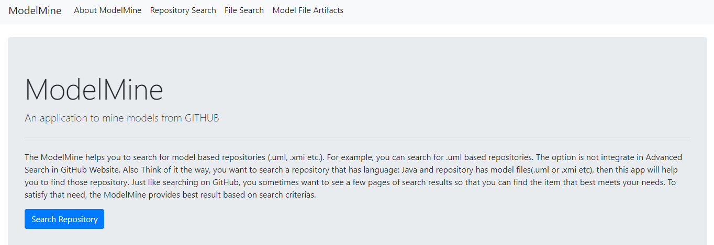
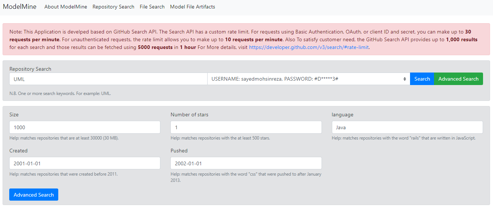
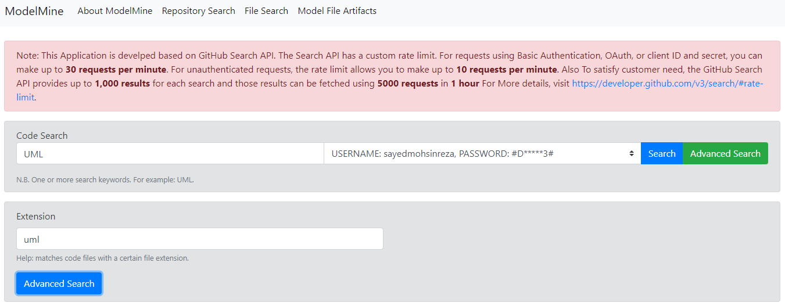

# ModelMine
An application to mine models from GITHUB

The ModelMine helps you to search for model based repositories (.uml, .xmi etc.). For example, you can search for .uml based repositories. The option is not integrate in Advanced Search in GitHub Website. Also Think of it the way, you want to search a repository that has language: Java and repository has model files(.uml or .xmi etc), then this app will help you to find those repository. Just like searching on GitHub, you sometimes want to see a few pages of search results so that you can find the item that best meets your needs. To satisfy that need, the ModelMine provides best result based on search criterias.


**Steps to run this ModelMineApplication**

1. Install an APACHE SERVER to run PHP scripts. For example: https://www.apachefriends.org/ 
2. Go to installation location. For example: `C:\xampp\htdocs\`
3. Download this repository and keep in the `C:\xampp\htdocs\ModelMine folder`.
4. Edit the following information (username and password ) in  `definedVariables.php`. You can add multiple GitHub accounts.
```
define('GITHUB_CREDENTIALS', array(	
	 array('username'=>'INPUT_GITHUB_USERNAME', 'password' => 'INPUT_GITHUB_PASSWORD'),
	 array('username'=>'INPUT_GITHUB_USERNAME_2', 'password' => 'INPUT_GITHUB_PASSWORD_2')
	)
);
```
5. Start Apache Server and then browser and type `http://localhost/ModelMine/`

!!!Enjoy ModelMine Application!!!

# Screenshots



